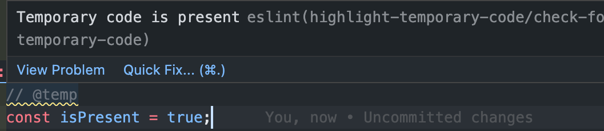

# eslint-plugin-temporary-code

## Problem : 

Sometimes during development, we might change a dynamic logic to something static for testing out different scenarios without relying upon the application state.

What if we forget to revoke those temporary changes and unfortunately there is no unit test cases to catch it? 

This plugin would help you remember those temporary code by throwing a eslint warning on it.

## How it works
It searches for comments containing 
```
@temp 
```
and warns about it. The user is expected to add a line of comment that contains ```@temp ``` above or below his temporary code so that the plugin highlights it until its gone.


## Installation

You'll first need to install [ESLint](https://eslint.org/):

```sh
npm i -D eslint
```

Next, install `eslint-plugin-temporary-code`:

```sh
npm i -D eslint-plugin-temporary-code
```

## Usage

Add `temporary-code` to the plugins section of your `.eslintrc` configuration file. You can omit the `eslint-plugin-` prefix:

```json
{
    "plugins": [
        "highlight-temporary-code"
    ]
}
```

Then configure the rule under the rules section.

```json
{
    "rules": {
        "highlight-temporary-code/check-for-temporary-code": "warn"
    }
}
```

## Example code : 
In the code, while entering the temporary code statement add the comment 
```@temp``` above or below it.

Let say,if we temporarily replace the below 
```sh
const isPresent = someFunctioThatReturnsTrueOrFalse()
```
with 

```
const isPresent = false
```
then replace it like

```
// @temp
const isPresent = false
```
or
```
/* @temp */
const isPresent = false
```

so that the plugin would know that this is the temporary code and throws a eslint warning.

### Note : 
It works in jsx with

 ```
 {/* @temp */}
 ```


